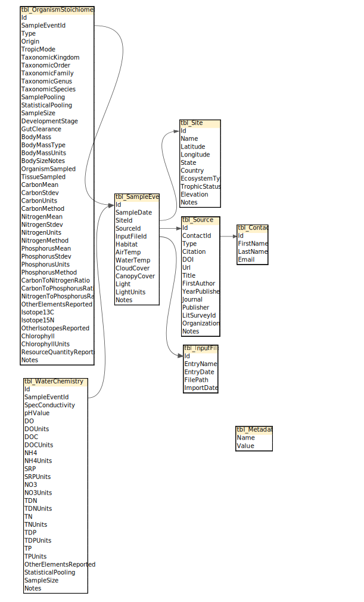

<style type="text/css">
body{
  font-size: 12pt;
}
/* Headers */
h1,h2,h3{
  font-size: 14pt;
  font-weight: bold;
}
h4,h5,h6{
  font-size: 12pt;
  font-weight: bold;
}
</style>

```{r setup, include=FALSE}
knitr::opts_chunk$set(echo = TRUE)

library(tibble)
library(dplyr)
library(tidyr)
library(stringr)
library(readr)
library(gt)
library(glue)
library(gluedown)
library(kableExtra)
```

```{r loadData, include=FALSE}
# formatTable <- function(tableName, tableSTOICH){
#   tableNEON <- select(filter(tableNEON, STOICH_db_Table == tableName), !c(STOICH_db_Table)) %>%
#     mutate(NEON_Data=if_else(is.na(Set_Value),
#                              if_else(is.na(NEON_Table) & is.na(NEON_Table_Variable), 
#                                      NEON_Table, 
#                                      paste(NEON_Table, NEON_Table_Variable, Operation_Using_NEON_Variable, sep=" -> ")),
#                              if_else(is.na(NEON_Table), Set_Value, paste(Set_Value, " (", NEON_Table, ")", sep=""))),
#            .keep="unused")
#   return(tableNEON)
# }

library(tidyverse)
library(lubridate)
library(sf)
library(units)
library(stoichUtilities)

basePath <- do.call(file.path, as.list(str_split(Sys.getenv("HOME"), "\\\\")[[1]]))
stoichData <- stoichUtilities::loadSTOICH(dataPath=file.path(basePath, "data"))
stoichCols <- names(stoichData)
stoichTbl <- tibble(index = 1:100)
for (i in stoichCols){
  stoichTbl <- left_join(stoichTbl, tibble(x = colnames(stoichData[[i]])) %>% mutate(index=seq(n())), by="index")
  
  colnames(stoichTbl) <- c(colnames(stoichTbl)[1:length(colnames(stoichTbl))-1], i)
}

stoichTbl <- stoichTbl %>%
  select(c("tbl_InputFile", "tbl_Contact", "tbl_Source", "tbl_Site", "tbl_SampleEvent", "tbl_OrganismStoichiometry", "tbl_WaterChemistry")) %>%
  distinct()

stoichTbl <- stoichTbl %>% 
  slice_head(n=nrow(stoichTbl)-1)

stoichSample <- stoichUtilities::joinSTOICH(stoichData) %>%
  slice_sample(n=5)
```

# Getting Started with the Utilities
The STOICH-utilities R package provides user tools for working with STOICH database files. This package is designed to enable easier and more robust access to the data files from STOICH database releases.

The STOICH API "stoichUtilities" is an R library, as such you will need to have R installed. It is recommended to install RStudio (https://www.rstudio.com/) to help manage packages and provide an integrated development environment (IDE).

## Installation

### Download Source Files
There are 2 options to get the source files:
* From the GitHub project page click the green Code button and choose "Download Zip"
* Use GitHub Desktop or CLI programs to Clone the STOICH-Utilities repository (click the green Code button to copy the URL from the GitHub project page).

### Open and Build the R Library
Navigate to the source code location and open stoichUtilities\stoichUtilities.Rproj in RStudio.

Build the documentation: *ctrl* + *shift* + *D* or with the menu **Build** -> **Document**

Install the library and restart the R session: *ctrl* + *shift* + *B* or with the menu **Build** -> **Install and Restart**

### Installing Required Packages
The stoichUtilities uses several other packages. Install the required packages.
```{r package-install, eval=FALSE}
install.packages(“tidyverse”)
install.packages(“lubridate”)
install.packages(“sf”)
install.packages(“units”)
```

## Unpacking the Data
The Beta STOICH-utilities GitHub code comes with a file: *Beta_Release_Data.zip*, please unzip this file to a director (later assumed to be in the users home directory with the folder name *Data*).

## Using the R Library
### Load the Required Libraries.
```{r load-packages, eval=FALSE}
# Tidyverse and other support libraries
library(tidyverse)
library(lubridate)
library(sf)
library(units)

# Load stoichUtilities
library(stoichUtilities)
```

### Working with STOICH Data
```{r using-utilities, eval=FALSE}
# Create a variable to store the user's home directory
basePath <- do.call(file.path, as.list(str_split(Sys.getenv("HOME"), "\\\\")[[1]]))

# Load the STOICH data (assumed to be in a directory named "data" inside the home directory)
stoichData <- stoichUtilities::loadSTOICH(dataPath=file.path(basePath, "data"))

# Filter the STOICH data
stoichFiltered <- stoichUtilities::filterSTOICH(dataTables=stoichData, var="State", val="FL", condition="Equal")

# Match organism stoichiometry data with water chemsitry data for samples that weren't taken at the exact same time
stoichPaired <- stoichUtilities::locateDataPairsSTOICH(stoichData, timeDiff=2, timeUnits="weeks", distance=5, pairMethod="Min Time", ignoreExisting=TRUE)

# Join all the tables into one large wide table
stoichTable <- stoichUtilities::joinSTOICH(stoichPaired)

```

### Example of Mapping STOICH Data
Use the stoichTable from the previous section as the data table for mapping.
```{r mapping STOICH data, eval=FALSE}
# Install the Leaflet package if it isn't installed.
install.packages("leaflet")

# Load the leaflet library.
library(leaflet)

# Split out the GPS data.
gpsGroups <- stoichTable %>% 
  select(c("Latitude", "Longitude")) %>% 
  drop_na(Latitude, Longitude) %>% 
  # Round the GPS coordinates so small differences in location are lumped together.
  mutate(across(everything(), round, 2)) %>% 
  group_by(Latitude, Longitude) %>% 
  # Summarise to get the number of entries for each location in the database.
  summarise(nSamples=n(), .groups="keep") %>%
  # Add some scaling for the radius of the circle based on number of samples
  mutate(radius = 10*nSamples+500, .keep="all") %>%
  # Convert the numbers to characters for use in popups
  mutate(nSamples = as.character(nSamples), .keep="all")

# Start building the map.
leaflet() %>% 
  # Select the background style.
  addProviderTiles(providers$OpenTopoMap) %>%
  # Add some circles with radius based on scaled number of samples then enable popups to show the number of samples when you click on a circle.
  addCircles(data = data.frame(gpsGroups), radius = ~radius, color="blue", popup=~nSamples)

```
### Help Documentation
You can also access documentation for any function using the help command.
```{r help-functions, eval=FALSE}
help(loadSTOICH)
```

# Guide to the STOICH Data
## Data Structure
{#id .class width=70% height=70%}

## Table Structure View

```{r STOICH-structure, echo = FALSE}
gt(stoichTbl) %>%
  tab_header(
    title = "STOICH Data Table Structure",
    subtitle = "(variables for each table in the data set)"
  )%>%
  tab_options(
    table.align = "left",
    table.font.size = "small",
    column_labels.font.weight = "bold",
    data_row.padding.horizontal = px(10),
    column_labels.padding.horizontal = px(10)
  ) %>%
  tab_style(
    style = list(
      cell_borders(
        sides = "all",
        color = "#000000",
        style = "solid",
        weight = px(1)
      ),
      cell_borders(
        sides = "all",
        color = "#000000",
        style = "solid",
        weight = px(1)
      )
    ),
    locations = list(
      cells_body(
        columns = everything(),
        rows = everything()
      ),
      cells_column_labels(
        columns = everything()
      )
    )
  )
```


## Sample Table
Columns are labeled using the following format **{variable name}.{table name}** where **{table name}** doesn't include the **tbl_** from the start of the table name.
```{r STOICH-sample, echo = FALSE}
gt(stoichSample) %>%
  tab_header(
    title = "Sample of the STOICH Data",
    subtitle = ""
  )%>%
  tab_options(
    table.align = "left",
    table.font.size = "small",
    column_labels.font.weight = "bold",
    data_row.padding.horizontal = px(10),
    column_labels.padding.horizontal = px(10)
  ) %>%
  tab_style(
    style = list(
      cell_borders(
        sides = "all",
        color = "#000000",
        style = "solid",
        weight = px(1)
      ),
      cell_borders(
        sides = "all",
        color = "#000000",
        style = "solid",
        weight = px(1)
      )
    ),
    locations = list(
      cells_body(
        columns = everything(),
        rows = everything()
      ),
      cells_column_labels(
        columns = everything()
      )
    )
  )
```
