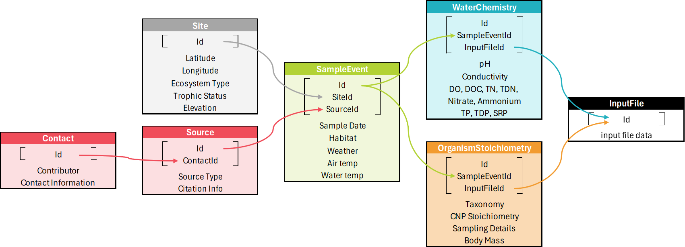

<style type="text/css">
body{
  font-size: 12pt;
}
/* Headers */
h1,h2,h3{
  font-size: 14pt;
  font-weight: bold;
}
h4,h5,h6{
  font-size: 12pt;
  font-weight: bold;
}
</style>

```{r setup, include=FALSE}
knitr::opts_chunk$set(echo = TRUE)

library(gt)
library(glue)
library(gluedown)
library(kableExtra)
```

```{r loadData, include=FALSE}
# formatTable <- function(tableName, tableSTOICH){
#   tableNEON <- select(filter(tableNEON, STOICH_db_Table == tableName), !c(STOICH_db_Table)) %>%
#     mutate(NEON_Data=if_else(is.na(Set_Value),
#                              if_else(is.na(NEON_Table) & is.na(NEON_Table_Variable), 
#                                      NEON_Table, 
#                                      paste(NEON_Table, NEON_Table_Variable, Operation_Using_NEON_Variable, sep=" -> ")),
#                              if_else(is.na(NEON_Table), Set_Value, paste(Set_Value, " (", NEON_Table, ")", sep=""))),
#            .keep="unused")
#   return(tableNEON)
# }

library(tidyverse)
# library(tibble)
# library(dplyr)
# library(tidyr)
# library(purrr)
# library(stringr)
# library(readr)
library(lubridate)
library(sf)
library(units)
library(jsonlite)
library(stoichUtilities)

basePath <- system.file("testdata", "STOICH_NEON_Only_2025-09-10", package="stoichUtilities")
stoichData <- stoichUtilities::loadSTOICH(dataPath=basePath)
stoichCols <- names(stoichData)
stoichTbl <- tibble(index = 1:100)
for (i in stoichCols){
  stoichTbl <- left_join(stoichTbl, tibble(x = colnames(stoichData[[i]])) %>% mutate(index=seq(n())), by="index")
  
  colnames(stoichTbl) <- c(colnames(stoichTbl)[1:length(colnames(stoichTbl))-1], i)
}

stoichTbl <- stoichTbl %>%
  select(c("tbl_InputFile", "tbl_Contact", "tbl_Source", "tbl_Site", "tbl_SampleEvent", "tbl_OrganismStoichiometry", "tbl_WaterChemistry")) %>%
  distinct()

stoichTbl <- stoichTbl %>% 
  slice_head(n=nrow(stoichTbl)-1) %>% 
  mutate(across(everything(), ~if_else(is.na(.x), "", .x)))

stoichSample <- stoichUtilities::joinSTOICH(stoichData) %>%
  slice_sample(n=5)
```

# Getting Started with the Utilities
The STOICH-utilities R package provides user tools for working with STOICH database files. This package is designed to enable easier and more robust access to the data files from STOICH database releases.

The STOICH API "stoichUtilities" is an R library, as such you will need to have R installed. It is recommended to install RStudio (https://www.rstudio.com/) to help manage packages and provide an integrated development environment (IDE).

## Installation

There are 3 options for installing the stoichUtilities package. Installing a prebuilt package contains the vignette, while a standard "Install and Restart" won't contain the vignette. Instructions for building your own package from source to get the vignette are also included.

### Option 1: Install Through CRAN
```{r stoich-install, eval=FALSE}
install.packages(“stoichUtilties”)
```

### Option 2: Install a PreBuilt Package
Download the *stoichUtilities_x.x.x.xxxx.tar.gz* file.

Select the menu option **Tools** -> **Install Packages**

A window should pop up. For **Install from:** choose **Package Archive File** and navigate to the location of the tar.gz file.

Click "Install"
### Option 3: Install from Source
#### Download Source Files
There are 2 options to get the source files:
* From the GitHub project page click the green Code button and choose "Download Zip"
* Use GitHub Desktop or CLI programs to Clone the STOICH-Utilities repository (click the green Code button to copy the URL from the GitHub project page).
#### Simple Install: Open and Build the R Library
Navigate to the source code location and open stoichUtilities\stoichUtilities.Rproj in RStudio.

Build the documentation: *ctrl* + *shift* + *D* or with the menu **Build** -> **Document**

Install the library and restart the R session: *ctrl* + *shift* + *B* or with the menu **Build** -> **Install and Restart**

#### Build Package Method: Build and Install Package from Source
Navigate to the source code location and open stoichUtilities\stoichUtilities.Rproj in RStudio.

Select the menu option **Build** -> **Build Source Package**

To install the package, follow instructions for Installing a PreBuilt Package.

### Installing Required Packages (required for options 2 & 3)
The stoichUtilities uses several other packages. Install the required packages.
```{r package-install, eval=FALSE}
install.packages(“tidyverse”)
install.packages(“lubridate”)
install.packages(“sf”)
install.packages(“units”)
```

## Unpacking the Data
The Beta STOICH-utilities GitHub code comes with a file: *Beta_Release_Data.zip*, please unzip this file to a director (later assumed to be in the users home directory with the folder name *Data*).

## Using the R Library
### Load the Required Libraries.
```{r load-packages, eval=FALSE}
# Tidyverse and other support libraries
library(tidyverse)
library(lubridate)
library(sf)
library(units)

# Load stoichUtilities
library(stoichUtilities)
```

### Working with STOICH Data
```{r using-utilities, eval=FALSE}
# Load the STOICH data (assumed to be in a directory named "data" inside the home directory)
stoichData <- loadSTOICH(dataPath=file.path(path.expand("~"), "data"))

# Filter the STOICH data
stoichFiltered <- filterSTOICH(dataTables=stoichData, 
                               var="State", 
                               val="North Dakota", 
                               condition="Equal")

# Match organism stoichiometry data with water chemsitry data for samples that weren't taken at the exact same time
stoichPaired <- locateDataPairsSTOICH(stoichData, 
                                      timeDiff=2, 
                                      timeUnits="weeks", 
                                      distance=2, 
                                      pairMethod="Min Time", 
                                      ignoreExisting=TRUE)

# Join all the tables into one large wide table
stoichTable <- joinSTOICH(stoichPaired)

```

### Example of Mapping STOICH Data
Use the tbl_Site table from stoichData for Site information for mapping.
```{r mapping STOICH data, eval=TRUE}
# Count how many sites are in each state.
stateCounts <- stoichData$tbl_Site |>
  select(c("State")) |> 
  drop_na(State) |>
  # Change the data to lowercase to allow the table to merge with the Tidyverse state data
  mutate(State=str_to_lower(State)) |>
  group_by(State) |>
  # Summarise to get the number of sites for each state.
  summarise(nSites=n(), .groups="keep")

# Use state data from Tidyverse and join the site data to it.
us_states <- map_data("state") |>
  left_join(stateCounts, by=c("region"="State"))

# Create a list of states in the Tidyverse dataset so only data from states with boundaries are used.
stateList <- unique(us_states$region)

# Split out the GPS data to map individual sites.
gpsSites <- stoichData$tbl_Site |>
  filter(str_to_lower(State) %in% stateList) |>
  select(c("Latitude", "Longitude")) |>
  drop_na(Latitude, Longitude) |>
  # Round the gps coordinates so points that are close will be merged into a single point.
  mutate(across(everything(), ~round(.x, 2))) |>
  unique()

# Start building the map.
ggplot(data=us_states, mapping=aes(x=long, y=lat, group=group, fill=nSites)) +
  geom_polygon(color="black") +
  theme(legend.position = "bottom") +
  geom_point(data=gpsSites, aes(x=Longitude, y=Latitude, group=NA), size=2, shape=23, fill="orange")

```

### Help Documentation
You can also access documentation for any function using the help command.
```{r help-functions, eval=FALSE}
help(loadSTOICH)
```

# Guide to the STOICH Data
## Data Structure
{#id .class width=90% height=90%}

## Table Structure View

```{r STOICH-structure, echo = FALSE}
gt(stoichTbl) %>%
  tab_header(
    title = "STOICH Data Table Structure",
    subtitle = "(variables for each table in the data set)"
  ) %>%
  tab_options(
    table.align = "left",
    table.font.size = "small",
    column_labels.font.weight = "bold",
    data_row.padding.horizontal = px(10),
    column_labels.padding.horizontal = px(10)
  ) %>%
  tab_style(
    style = list(
      cell_borders(
        sides = "all",
        color = "#000000",
        style = "solid",
        weight = px(1)
      ),
      cell_borders(
        sides = "all",
        color = "#000000",
        style = "solid",
        weight = px(1)
      )
    ),
    locations = list(
      cells_body(
        columns = everything(),
        rows = everything()
      ),
      cells_column_labels(
        columns = everything()
      )
    )
  )
```


## Sample Table
Columns are labeled using the following format **{variable name}.{table name}** where **{table name}** doesn't include the **tbl_** from the start of the table name.
```{r STOICH-sample, echo = FALSE}
gt(stoichSample) %>%
  tab_header(
    title = "Sample of the STOICH Data",
    subtitle = ""
  )%>%
  tab_options(
    table.align = "left",
    table.font.size = "small",
    column_labels.font.weight = "bold",
    data_row.padding.horizontal = px(10),
    column_labels.padding.horizontal = px(10)
  ) %>%
  tab_style(
    style = list(
      cell_borders(
        sides = "all",
        color = "#000000",
        style = "solid",
        weight = px(1)
      ),
      cell_borders(
        sides = "all",
        color = "#000000",
        style = "solid",
        weight = px(1)
      )
    ),
    locations = list(
      cells_body(
        columns = everything(),
        rows = everything()
      ),
      cells_column_labels(
        columns = everything()
      )
    )
  )
```
